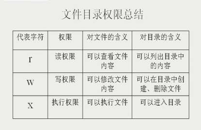

# 权限问题

### 命令权限

linux命令大致分两种：
1. 仅管理员root可以执行的命令  /sbin    /usr/sbin
2. 所有人可以执行的命令      /bin     /usr/bin

### ls -l查看文件
利用ls -l 查看文件得到结果的各个段的含义：  

    drwxr-xr-x   3     root   root  4096    Jan 1 22:39  Projects
    文件类型和权限 硬链接数 所有者 所属组 文件大小 文件创建或最后修改时间  文件名
    第一个字符：文件类型 （d：目录    -:二进制文件  l:软连接文件)
    后九个字符：分别对应文件拥有者u，所在组g，其他人o 对该文件的权限（r：读权限  w:写权限  x:执行权限）
    
### 文件夹和文件的r/w/x权限

认真思考这个例子：

    用root身份新建一个文件夹test，里面新建一个文件testfile，使用chmod 777  testfile改变testfile的权限为任何人可读可写可执行，
    test文件夹权限默认，此时切换到普通用户，尝试删除testfile文件，权限不够！
    
    若使用 chmod  777  test改变test文件夹权限，然后chmod 644  testfile改变testfile文件权限，
    此时切换到普通用户却可以删除testfile！
    
    也就是，普通用户对文件拥有完全的权限，却无法删除文件；对文件所在文件夹有完全权限，可以删除文件夹内的文件。

对于文件：

    -r ---> 可以cat   more  head  tail
    -w---> 可以 echo    vi
    -x---> 执行

对于目录：

    -r --->可以  ls  
    -w---> 在目录中创建(touch,mkdir)，删除(rm)文件
    -x----> 可以进入目录(cd)

可以看出，要新建，删除文件，关键看用户对所在目录的权限，而不是看对文件自身的权限！！！

### 改变文件的所有者和所属组

- chown 用户名  文件：改变文件所属者
- chgrp  组名  文件：改变文件所属组 
- umask [-S] ：查看缺省权限，掩码值。

例如：

    [root@localhost root]# umask
    0022
    
第一个0位特殊权限位，真实权限是 777-022=755

### 常用命令

- pwd：  print working directory 显示当前所在目录
- 复制文件夹： cp  -R  目录名  目的地
- ctrl+c ：终止命令执行
- mv 文件 目的[/文件名]： 剪切（或叫移动）文件，并可以重命名（例如： rm   /test/test1.c   /mytest/test.c,将test文件夹下的test1.c剪切到mytest目录下，并重新命名为test.c）
- rm -rf 目录名：删除目录（注：-f是force，强制删除不确认，若不加的话，系统会对每个文件都确认一遍，很繁琐）
- more 文件名： 分页显示文件内容， 空格键--翻页  Enter；逐行滚动   q：退出（例如： more   /etc/services）
- head  -num  文件名：  查看文件前几行
- tail  -num 文件名：  查看文件最后几行
- ln    源文件   目标文件： 创建（硬）链接文件。例如：ln  /etc/issue  /etc/issue.hard
- ln  -s  源文件   目标文件： 创建软链接文件。例如：ln -s /etc/issue   /test/issue.soft

### 软链接和硬链接

    软连接只是一个符号链接，相当于windows中的快捷方式，占用空间很少；而硬链接相当于是源文件的一份拷贝，权限和大小都和源文件一样，
    与拷贝不同的是，硬链接和源文件是同步更新的，改变一个，另一个跟着也改变！另外，删除源文件后，软链接不可访问（类似于快捷方式），
    而硬链接文件可以继续访问（因为硬链接相当于复制，只是多了和源文件同步更新的功能）。
    
    硬链接为什么能和源文件同步？因为它们具有相同的inode，即一个inode映射到了两个文件（i节点，就是一个数字标识，Linux通过数字标识来管理和访问文件，
    每个文件都有一个inode）。
    
    软硬链接还有一个不同：软链接可以跨文件系统，而硬链接不能。
    即例如：不能将  /etc 目录下的文件硬链接到非 /etc 目录下，只能在同一个目录下创建硬链接文件。

