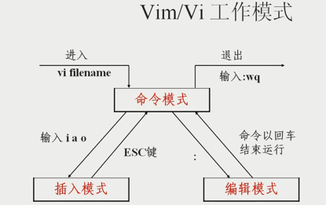

# VIM编辑器

## vim编辑器工作模式

1. 打开（新建）文件后默认进入命令模式。
2. 命令模式进入到插入模式： 按 i 或 a 或o.
3. 插入模式回到命令模式： 按ESC键。
4. 要在文件中运行其他命令，按:进入到编辑模式。例如  :set nu[mber] 显示行号。结束编辑模式下命令的运行，按Enter键。
5. 退出文件， ：wq 保存退出（write quit）

## 第1组：插入命令

- a  在光标后附加文本
- A  在本行行末附加文本
- i   在光标前插入文本
- I   在本行开始插入文本
- o   在光标下插入新行
- O   在光标上插入新行

## 第2组：定位命令

- h,方向左键    左移一个字符
- j，方向下键   下移一行
- k，方向上键  上移一行
- l，方向右键   右移一个字符
- $             移至行尾
- 0             移至行首
- H             移至屏幕上端
- M             移至屏幕中央
- L              移至屏幕下端
- :set nu          显示行号
- :set nonu        取消行号
- gg             到第一行
- G              到最后一行
- nG           到第n行
- :n            到第n行

## 第3组：删除命令

- x    删除光标所在字符
- nx   删除光标后n个字符
- dd   删除光标所在行
- ndd  删除光标后n行
- dG   删除光标所在行到文件末尾的内容
- D    删除从光标处到所在行末尾的内容
- :n1,n2d  删除指定范围的行

## 第4组：复制剪切命令

- yy或Y  复制当前行
- nyy  nY   复制当前行以下n行
- dd     剪切单前行
- ndd    剪切当前以下n行
- p[P] 粘贴在当前光标所在行下[行上]

## 第5组：替换和取消命令

- r     取代光标所在处字符
- R    从光标所在处开始替换字符，按Esc结束
- u    取消上一步操作

## 第6组：搜索和替换命令

- /string   向前搜索指定字串，搜索时忽略大小写:set  ic，区分大小写:set  noic
- n   搜索指定字符串的下一个出现位置（next）,N从后往前找
- :%s/old/new/g   全文替换指定字符串
- :n1,n2s/old/new/g  在一定范围内替换指定字符串,最后是/c时要确认

## 第7组：保存和退出命令

- :wq   保存退出，等同于shift zz,等同于ZZ
- :wq!    对于readonly的文件强行保存退出（只能文件的所有者或root管理员才能使用）
- :q!     退出，不保存
- :w      仅保存一下，不退出（相当于windows保存）
- :w  /backup  保存到/backup目录下（另存为）

## 其他用法：

- :r  文件名     导入文件（到光标所在位置）
- :!  命令       在vi中执行命令
两者可以结合使用，例如   `:r  !date`  将当前时间导入文件（光标所在位置）

- :ab  str1  str2   用str2替换str1，输入str1后回车，就会变成str2，例如 `:ab  myname  barretyi`,
则插入myname后回车就会换成barretyi;取消可以用`:unab  myname`

## 更改vi编辑器的配置文件

vi编辑器的配置文件默认放在每个用户的宿主目录下面，~/.vimrc
(缺省此文件是空的，需要自己编辑，例如，可以在里面写入set  nu ，则每次使用vi都显示行号)

