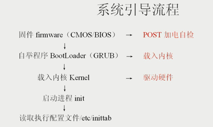
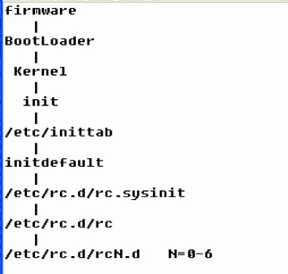
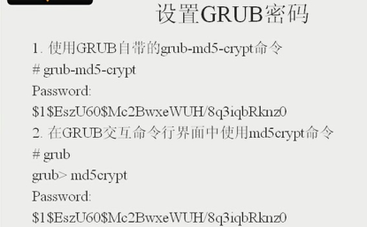
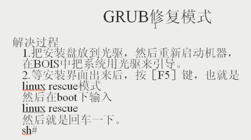

# Linux系统引导流程

 
## 1. 系统启动步骤

    1. post：power on self test,加电自检。
    固件（firmware）被固化在主板上，介于软件和硬件之间。CMOS是固化在主板上的程序，BIOS是操作CMOS的界面；不同系统的固件平台和进入方法是不同的。
    
    Linux下跟固件相关的常用设置就是设置硬件时钟(hardware clock),通过date命令查看的时钟叫软件时钟。
    date:  查看软件时钟
    hwclock: 查看硬件时钟
    
    2. 固件读取成功后，读取MBR：master boot record,位于硬盘的0柱面，0磁头，1扇区。
    载入MBR中存放的自举程序BootLoader（GRUB）： 载入内核
    
    查看grub配置文件： vi  /etc/grub.conf（此处是一个链接文件，真实位于/boot目录下，使用ls /boot可以查看到内核文件）
     kernel /vmlinuz-2.4.20-8 ro root=LABEL=/ hdc=ide-scsi
    以上是grub.conf中非常重要的一行，表示内核信息，其中2.4.20-8表示内核的版本号，第一个2表示主版本号，4表示次版本号，20-8表示末版本号，次版本号比较重要，我们可以自己下载Linux内核进行升级，但要注意次版本号，次版本号为奇数时表示内核为测试版，可能不稳定！！！偶数表示为正式版。
    
    3. 内核载入后，驱动硬件（内核文件很大，其中很大部分是各种硬件的驱动程序，如果要将Linux内核安装到某个特定的小型设备，可以裁剪内核，
    只保留该设备需要的驱动程序），内核文件是一个压缩文件，系统启动时会边解压边载入内核。
    
    
    4. 内核启动进程init
    init进程是第一个可以存在的进程，它的PID恒为1，但它必须向一个更高级的功能负责：PID为0的内核调度器（Kernel Schedule），
    从而获取CPU时间。Linux下init进程是所有进程的父进程。利用ps -le | more 命令可以查看到所有进程的PPID是1，即init进程。
    
    5. init进程启动后读取配置文件/etc/inittab文件。

## 2. Linux运行级别

    查看当前运行级别： runlevel
    切换运行级别：init [0123456Ss]

查看运行级别分类: `cat  /etc/inittab`

    # Default runlevel. The runlevels used by RHS are:
    #   0 - halt (Do NOT set initdefault to this)
    #   1 - Single user mode
    #   2 - Multiuser, without NFS (The same as 3, if you do not have networking)
    #   3 - Full multiuser mode
    #   4 - unused
    #   5 - X11
    #   6 - reboot (Do NOT set initdefault to this)

    man  inittab : 查看系统配置文件的帮助文档（注意：只能这样查看系统配置文件的帮助文档，且不能写绝对路径。）
    通过此命令可以查看到/etc/inittab的文件格式为：  `id:runlevels:action:process`
    
    /etc/rc.d/rc.sysinit 是一个shell脚本：完成系统服务程序的启动，如系统环境变量设置，设置系统时钟，加载字体，
    检查加载文件系统，生成系统启动信息日志文件等等。
    
    /etc/rc.d 目录下存放的系统脚本很重要，/etc/rc.d/rc[0123456].d存放了对应的运行级别需要启动和关闭的脚本，
    其中以K（kill）开头的表示不启动，以S（start）开头的表示启动（注意：K  S必须都是大写！）。
    例如：ls /etc/rc.d/rc3.d可以查看在运行级别3下面需要启动和关闭的脚本程序。
    例如：对于级别3下的文件 S03vmware-tools是开机自启动的，为了节约内存和cpu资源，我们不希望它自启动，可以将其禁用，
    cd  /etc/rc.d/rc3.d   ,然后mv   S03vmware-tools  K 03vmware-tools 即可。
    
    /etc/rc.d/init.d目录：该目录包含了各个运行级别的服务程序脚本。
    要手工启动或关闭服务： /etc/rc.d/init.d/服务脚本名称 ，然后回车，例如：/etc/rc.d/init.d/sshd,回车后会列出使用方法，
    例如：/etc/rc.d/init.d/sshd  start

 

## 3. Linux启动服务管理

    chkconfig:查看或启动或关闭启动项
    ntsysv:图形界面方式添加或删除自启动项

## 4. GRUB配置与应用

    grub 配置文件:  /boot/grub/grub.conf
    
使用cat  /etc/grub/grub.conf得到以下内容：

    default=0
    timeout=10
    splashimage=(hd0,0)/grub/splash.xpm.gz
    title Red Hat Linux (2.4.20-8)
            root (hd0,0)
            kernel /vmlinuz-2.4.20-8 ro root=LABEL=/ hdc=ide-scsi
            initrd /initrd-2.4.20-8.img
其中，

    default 定义缺省启动系统
    timeout 定义缺省等待时间
    splashimage 定义GRUB界面图片，本项后面的(hd0,0)表示第一块硬盘的第一个分区
    hiddenmenu  隐藏菜单
    title   定义菜单项名称
    root  设置GRUB的根设备（即内核）所在位置
    kernel  定义内核所在位置
    initrd  命令载入系统所需镜像文件 
    
    后4项比较重要！
    
Grub应用案例：
 
    通常，在服务器前的任何人都可以进入单用户模式修改root密码，为了避免此种情况，可以上锁机房，不让人接近；
    另一种方法是给grub设置密码。
    

 
 
grub修复主要出现在升级内核出错或者grub的配置文件出错，试验中例如：
将/boot/grub/grub.conf中的kernel /vmlinuz-2.4.20-8 ro root=LABEL=/ hdc=ide-scsi 行中的vmlinuz写成了vmlinux,
此时手工引导系统(见上图，即将grub.conf重新手工敲写一遍)，进入系统后再修改grub配置文件

对于特别严重的系统错误，致使无法进入到单用户模式和grub修复（例如inittab文件被破坏！
试验中可以删除/etc/inittab文件，删除之前先备份！！！），此时可以使用光盘修复（终极修复模式），见下图：

 
## 5. 启动故障分析与解决

    dmesg:查看系统启动日志
    
例如,

    想要查看系统启动时是否识别到网卡：dmesg | grep eth0
    想要查看系统启动时是否识别到添加的硬盘（即第二块硬盘）：dmesg | grep sdb

系统日志：

    /var/log/messages
    /var/log :存放所有日志文件
    
### 小技巧

查看配置文件时，要忽略注释行（以#开头的行）： `grep  -v  "^#"  /etc/inittab`

