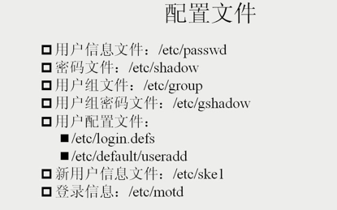
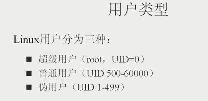

# 用户管理

## 配置文件

 
通过`man  5  passwd`,可以看到/etc/passwd文件格式

    account:password:UID:GID:GECOS:directory:shell
    
例如：

    barretyi:x:500:500::/home/barretyi:/bin/bash
 
## 用户类型

将普通用户的UID改为0后，这个用户就变成超级用户！即UID为0的用户为超级用户！

    echo "123"  |  md5sum : 生成123的md5密码

## 小技巧

在  `/etc/issue` 文件中可以设置登陆界面的提示信息。设置后每次登陆系统都会看到提示信息！
